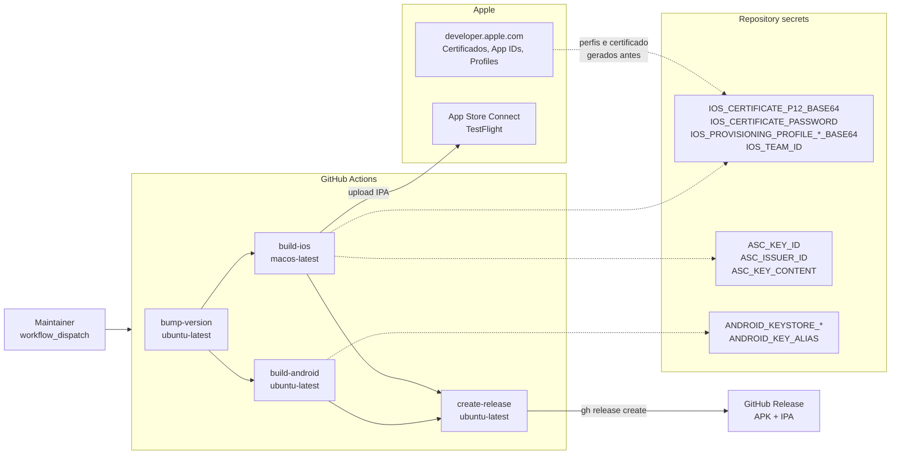
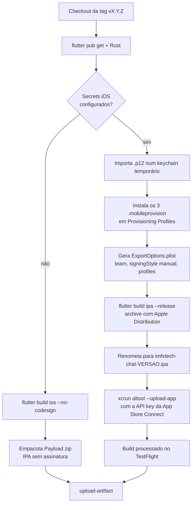
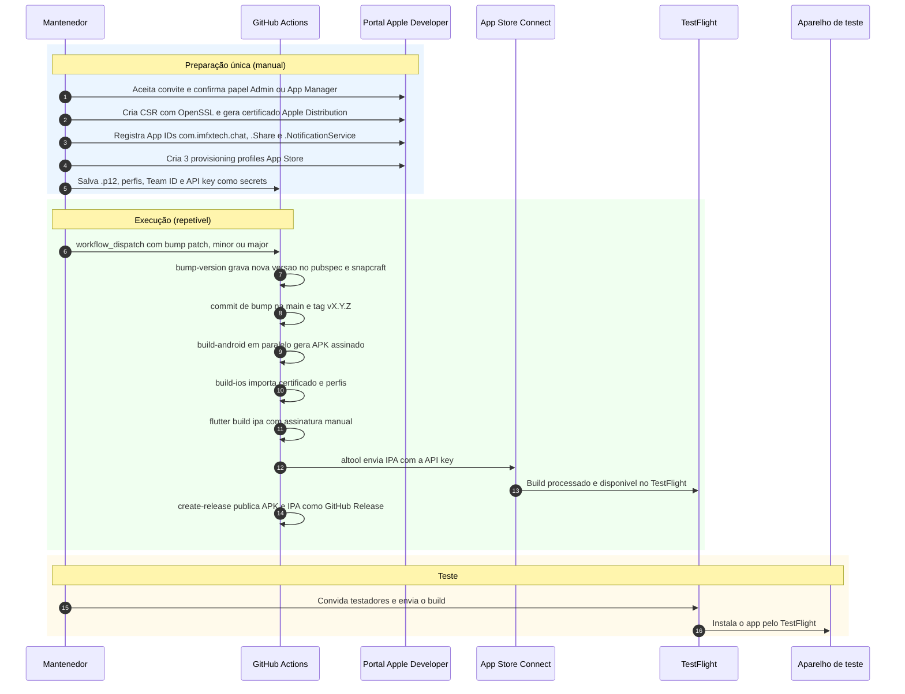

# Arquitetura e fluxo — publicação do IMFxTech Chat no iOS (TestFlight)

Descreve o pipeline real que está funcionando: workflow `Release and Build`
(`.github/workflows/release-and-build.yml`), disparado manualmente, que gera a
versão, assina o app iOS, envia pro TestFlight e publica a release no GitHub.

## Arquitetura

## Fluxo do job `build-ios`

## Sequência completa (do disparo à instalação no aparelho)

## Onde cada coisa está no repositório

| Peça | Arquivo |
|---|---|
| Pipeline | `.github/workflows/release-and-build.yml` |
| Versão | `scripts/bump_version.py`, `pubspec.yaml`, `snap/snapcraft.yaml` |
| Assinatura Xcode (Release) | `ios/Runner.xcodeproj/project.pbxproj` (manual, team `Q9FX293J5N`, perfis por target) |
| Entitlements | `ios/Runner/Runner.entitlements`, `ios/FluffyChat Share/*.entitlements`, `ios/Notification Service Extension/*.entitlements` |
| Passo a passo do Apple Developer | `docs/IOS_RELEASE_SIGNING.md` |
| Fastlane (não é mais usado no upload) | `ios/fastlane/Fastfile` |

## Pontos de atenção

- **Entitlements:** o perfil do app principal não inclui Push Notifications nem
  Associated Domains. Por isso ambos foram removidos de `Runner.entitlements`.
  Só voltam quando o App ID tiver essas capabilities e o perfil for regenerado.
- **Versões sem release:** execuções que falham depois do bump deixam a tag e o
  commit de versão sem release publicada (1.0.4, 1.0.5 e 1.0.6 ficaram assim).
- **Validade:** os perfis e o certificado vencem em 2027-10-03. Quando vencerem,
  é preciso gerar de novo e atualizar os secrets.
- **Conta:** os perfis foram criados no team `Q9FX293J5N`, de uma conta de
  pessoa física. Confirmar se é essa a conta que vai publicar o app da IMFxTech.
